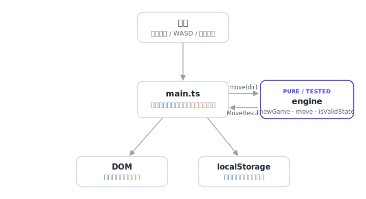

# kasanari

[](https://github.com/miruky/kasanari/actions/workflows/ci.yml)
[](https://github.com/miruky/kasanari/actions/workflows/deploy.yml)

[](LICENSE)

**足して10になる数字どうしを重ねて消す、スライド式の数字パズル。**

## 概要

4×4の盤面に、1から9までの数字タイルが並ぶ。矢印キー・WASD・スワイプのいずれかで全タイルを一方向へ滑らせると、ぶつかった2枚の和がちょうど10のときだけ両方が消え、10点が入る。1手で複数の組を同時に消すとコンボボーナスがつく。タイルは1手ごとに1枚増え、小さい数ほど出やすい。盤面が埋まり、隣り合うどの2枚の和も10にならなくなったら手詰まりで終了する。

スコアと進行中の盤面はブラウザの localStorage に保存され、閉じても続きから再開できる。直前の1手だけ取り消せる。インストールやアカウントは不要で、サーバーとも通信しない。

盤面は4×4固定で、オンラインのランキングや対戦はない。取り消せるのは1手だけにしている。

### なぜ作ったのか

2048は「同じ数を合体させて倍々に大きくする」ゲームで、考えることは実質ひとつの規則に閉じている。kasanariは合体ではなく**和が10になる対を消す**ことを中心に据えた。プレイヤーは常に「いまの数を10にする相方はどれか」を探すことになり、大きい数ほど相方が限られて盤を圧迫する。

既存の2048クローンは見た目を変えただけで数理は倍化のままのものが多く、足し算の組み合わせを読む緊張感がなかった。その一点だけを差し替えた派生として作っている。

## アーキテクチャ

盤面のルールはすべて `engine` の純粋関数に閉じ込め、DOMやbrowser APIには一切触れない。`main.ts` は入力を方向に変換して `engine` に渡し、返ってきた結果を描画と保存に反映するだけの薄い層になっている。この分離のおかげで、ゲームのルールはbrowserなしでテストできる。



## 技術スタック

| カテゴリ | 技術 |
|:--|:--|
| 言語 | TypeScript 5 |
| ビルド | Vite 6 |
| テスト | Vitest 2 |
| リンタ | ESLint 9 / typescript-eslint 8 |
| フォーマッタ | Prettier 3 |
| CI・配信 | GitHub Actions / GitHub Pages |

## 遊び方

- **動かす**: 矢印キー、WASD、または盤面上のスワイプで、全タイルがその方向の端まで滑る。動かない方向を選んでも何も起きず、タイルも増えない。
- **消す**: 滑った先でぶつかった2枚の和が10なら、両方消えて10点。たとえば `3` の列に `7` が追突すると消える。`1 9 1` を左へ寄せると先頭の `1+9` だけが消え、残った `1` はそのまま。
- **コンボ**: 1手で2組以上を同時に消すと、2組目以降は1組につき10点上乗せされる(2組で30点、3組で50点)。
- **増える**: 有効な手のあとに1枚スポーンする。出る数は1〜9で、小さいほど確率が高い。
- **詰み**: 盤面が満杯で、上下左右に隣接するどの2枚の和も10にならなくなったら終了。

`新しいゲーム` でいつでも初めから、`1手もどす` で直前の手だけ取り消せる。

### ロジックを単体で使う

`src/lib` はUIから独立した小さなモジュールとして公開している。盤面操作だけを取り出して使える。

```ts
import { newGame, move, createRng } from './src/lib';

const rng = createRng(42); // シードを固定すると展開が決定的になる
let state = newGame(rng);

const result = move(state, 'left', rng);
console.log(result.moved); // 動いたか
console.log(result.pairs); // この手で消えた組数
console.log(result.gained); // 得点
console.log(result.state.over); // 手詰まりか
state = result.state;
```

`move` は盤面を変更せず、新しい状態を含む `MoveResult` を返す。`createRng` に同じシードを渡せば毎回同じゲームが再現できる。

## プロジェクト構成

- `index.html` — エントリポイント
- `src/main.ts` — 入力・描画・localStorageへの保存を担うUI層
- `src/lib/engine.ts` — スライド、消滅判定、スポーン、手詰まり判定の純粋関数
- `src/lib/index.ts` — engineの公開API
- `src/lib/engine.test.ts` — ロジックのテスト
- `src/style.css` — スタイル(ライト・ダーク両対応、reduced-motion対応)
- `public/` — ファビコンとロゴのSVG
- `docs/architecture.svg` — アーキテクチャ図
- `.github/workflows/` — CI(`ci.yml`)とPages配信(`deploy.yml`)

## はじめ方

### 前提条件

Node.js 22以上。

### セットアップ

```bash
git clone https://github.com/miruky/kasanari.git
cd kasanari
npm install
npm run dev
```

`npm run dev` で開発サーバーが立ち上がり、表示されたURLをbrowserで開くと遊べる。

### テストの実行

```bash
npm test
```

### Lintとフォーマット

```bash
npm run lint
npm run fmt
```

### ビルドと配信

```bash
npm run build    # 型チェックのうえ dist/ を生成
npm run preview  # ビルド結果をローカルで確認
```

mainブランチへのpushで `deploy.yml` がビルドしてGitHub Pagesへ公開する。Pagesはリポジトリ名のサブパス(`/kasanari/`)で配信されるため、配信時のみ環境変数 `VITE_BASE=/kasanari/` を渡して Vite の `base` を切り替えている。ローカルとルート配信では `base` は `/` のままでよい。

## 設計方針

- **ロジックとUIの分離** — `engine` はDOMもlocalStorageも知らない純粋関数の集まりにした。盤面の正しさはbrowserを立ち上げずに検証でき、UIは結果を映すだけの責務に絞れる。
- **決定的な乱数** — スポーンには外から渡すシード付きの小さなPRNGを使う。同じシードからは同じ展開になり、スポーンを含むテストが安定する。
- **不変な状態遷移** — `move` は受け取った状態を書き換えず、新しい状態を返す。直前の状態を保持するだけでアンドゥが成立し、描画の差分計算も素直になる。
- **動きは合成可能なプロパティで** — タイルの移動は `transform`、出現と消滅は `scale` と `opacity` に分け、互いに干渉させずにアニメーションさせる。すべて `prefers-reduced-motion: reduce` で無効化する。
- **保存は壊れても止まらない** — localStorageの読み書きは失敗とパース不能を握りつぶす。保存が使えない環境でも、その場のゲームは最後まで遊べる。

## ライセンス

[MIT](LICENSE)
